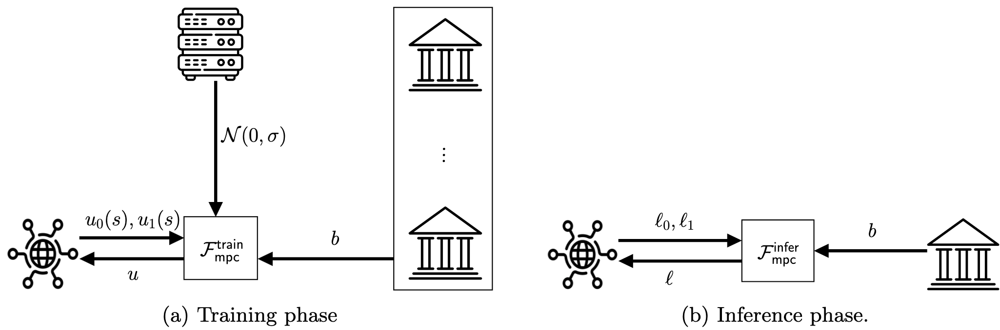

# Problem statement

The setting considers payment network systems handling transactions. In this setting, there is a number of financial institutions (or Banks) denoted by $B_i$ which route their transactions through a central hub $S$. The transaction messages include the following fields [[1]](https://www.drivendata.org/competitions/98/nist-federated-learning-1/page/524/):

1. `MessageId` - Globally unique identifier within this dataset for individual transactions
2. `UETR` - The Unique End-to-end Transaction Reference—a 36-character string enabling traceability of all individual transactions associated with a single end-to-end transaction
3.    `TransactionReference` - Unique identifier for an individual transaction
4.    `Timestamp` - Time at which the individual transaction was initiated
5. `Sender` - Institution (bank) initiating/sending the individual transaction
6. `Receiver` - Institution (bank) receiving the individual transaction
7. `OrderingAccount` - Account identifier for the originating ordering entity (individual or organization) for end-to-end transaction,
8.   `OrderingName` - Name for the originating ordering entity
9.  `OrderingStreet` - Street address for the originating ordering entity
10.   `OrderingCountryCityZip` - Remaining address details for the originating ordering entity
11.   `BeneficiaryAccount` - Account identifier for the final beneficiary entity (individual or organization) for end-to-end transaction
12.  `BeneficiaryName` - Name for the final beneficiary entity
13.    `BeneficiaryStreet` - Street address for the final beneficiary entity
14.  `BeneficiaryCountryCityZip` - Remaining address details for the final beneficiary entity
15.  `SettlementDate` - Date the individual transaction was settled
16.  `SettlementCurrency` - Currency used for transaction
17.  `SettlementAmount` - Value of the transaction net of fees/transfer charges/forex
18.  `InstructedCurrency` - Currency of the individual transaction as instructed to be paid by the Sender
19.  `InstructedAmount` - Value of the individual transaction as instructed to be paid by the Sender

As those transaction messages are communicated through $S$ in plaintext, $S$ is able to build a rich dataset that includes all of the above attributes. Naturally, for identifying anomalous transactions, $S$ would be the best choise to deploy machine learning techniques towards anomaly detection. Towards building a classification model, $S$ is provided with a training dataset $T$ which includes a number of transactions with the above fields, plus an additional `Label` Boolean attribute which indicates whether a transaction is anomalous or not. 

Banks participating in the network payment system each has a dataset with the following fields:

1. `Bank` - Identifier for the bank
2. `Account` - Identifier for the account
3. `Name` - Name of the account
4. `Street` - Street address associated with the account
5. `CountryCityZip` - Remaining address details associated with the account
6. `Flag` - Enumerated data type indicating potential issues or special features that have been associated with an account, with values as follows:
        `00` - No flag
        `01` - Account closed
        `03` - Account recently opened
        `04` - Name mismatch
        `05` - Account under monitoring
        `06` - Account suspended
        `07` - Account frozen
        `08` - Non-transaction account
        `09` - Beneficiary deceased
        `10` - Invalid company ID
        `11` - Invalid individual ID

As $S$ already knows all of the information held by Banks except the `Flag` associated with an account, the goal is to augment the machine learning model, taking this attribute into account. However due to privacy regulations and laws (e.g. [GDPR](https://eur-lex.europa.eu/EN/legal-content/summary/general-data-protection-regulation-gdpr.html)), this additional attribute needs to be shared with $S$ in a privacy-preserving way, namely enabling $S$ to enhance its model without directly learning `Flag`. In general, the primary goal is to enable $S$ to decide if a transaction is anomalous or not with high accuracy, while protecting against private data leakage from the respective data holders, while $S$ should be the only entity which learns the model's prediction.

# Solution overview

## Key observations

Based on the synthetic training datasets provided, we observed the following:

1. For all transactions, the sender account `Flag` in the corresponding bank dataset is always `00`. In other words, a transaction cannot spend funds from an account with an "abnormal" state. Therefore, only the receiving account `Flag` is of interest.
2. If the `Flag` (receiving) account attribute has a value other than `00`, then a transaction sending to this account is always marked as anomalous in the training dataset. The contrapositive is that  a transaction marked as non-anomalous, then the receiving account `Flag` is always `00`.

## Our approach

Our tailored solution leverages the above two observations. To incorporate the extra `Flag` information into the model maintained by $S$, we train it with a secret input distinguishing between normal and abnormal accounts. 
During training, $S$ selects a batch of transactions and computes updates to the model for both possible inputs for each transaction in the batch. For each transaction, $S$, the receiving bank, and a third party referred to as the *aggregator* perform an instance MPC. $S$ provides the two possible updates for the transaction, and the receiver bank provides a bit indicating whether the receiver account was normal or abnormal. 
The MPC ensures that the parties *obliviously* select the correct update, based on the bit provided by the receiver bank. All such selected updates are then aggregated. Finally, the aggregator also adds enough noise to hide contributions of individual transactions to protect against inference attacks by $S$. The MPC ensures that this aggregated and noised update for the entire batch is revealed to $S$ alone. The magnitude of noise used is a hyperparameter that depends on the batch size, the clipping bound, and the desired level of privacy. So, neither the aggregator nor the banks can gain insight into the transaction details.

During inference, when $S$ receives a transaction and wants to classify it, $S$ runs that transaction through the model with both inputs to obtain two possible model outputs, or labels. $S$ and the receiving bank perform an instance of secure two-party computation. $S$ provides the two possible labels for the transaction, and the receiver bank provides a bit indicating whether the receiver account was normal or abnormal. The computation ensures that the parties *obliviously* select the correct label and reveal it to $S$ alone.

## Implementing our approach

In our approach, $S$ trains a model with a secret input that differs for "normal" accounts and for "abnormal" accounts. $S$ initializes this model, but requires aid in training it.

### Setup \& Key Management

We assume there is an underlying PKI in place: all parties are aware of the public keys of the other parties and can use those to encrypt messages that can be decrypted only by said parties. $S$ uses the public keys of banks to encrypt account identifiers for them; the banks and $S$ use the public key of $S$ to encrypt other information.

### Training

$S$ initializes and manages the main training procedure which operates in batches. For each batch, $S$ randomly samples a batch $K$ of $k$ transactions ($k$ being a hyperparameter). For each transaction $s$, $S$ inputs $s$ through its model $M$ twice: once with the secret input set to normal and once to abnormal. Note that $S$ does not know if the receiving account flag is normal or abnormal, and thus compute two possible updates $u_0(s)$ and $u_1(s)$.

<!--- Let $B_r(s)$ denote the receiving bank for the transaction and $a_r(s)$ denote the receiving account at bank $B_r(s)$. $S$ sends $a_r(s)$ to $B_r(s)$. Then $S$, the aggregator and $B_r(s)$ engages in a secure multi-party computation (using secret sharing and oblivious transfer) with private inputs $[[u_0(s)]], [[u_1(s)]]$ from $S$, and the bit $[[b]]$ from $B_r(s)$ ($b$ is a bit that indicates whether the account $a_r(s)$ is normal or abnormal). The output of this computation is that $S$ and the aggregator learn secret shares of $u_{b}(s)$. Concretely, this value can be computed as
$[[u(s)]] = ([[1]]-[[b]]) \cdot [[u_0(s)]]  + [[b]] [[u_1(s)]]\\
    =[[b]] \cdot ([[u_1(s)]]-[[u_0(s)]])+[[u_0(s)]]$
using a single multiplication on the shared or encrypted data and then converted to shared between $S$ and the aggregator. See below for details on how this can be implemented. Outputting these secret shares has the privacy guarantee that neither $S$ nor the aggregator are able to learn the plaintext value of $u(s)$. For simplicity, let $[[u(s)]]$ denote the share held by $S$ and the aggregator.

The aggregator and $S$ repeat this process with each bank in batch $K$, resulting in batchsize many updates $[[u(s)]]$.
Note that these updates are likely from multiple banks. The aggregator encrypts a sample of Gaussian noise $\mathcal{N}(0,\sigma)$ with mean $0$ and standard deviation $\sigma$ obtaining $[[N(0,\sigma)]]$.
Aggregator and $S$ then aggregate all those shared updates and the noise, yielding
$$[[u]] = \sum_{s\in K}[[u(s)]] + [[N(0,\sigma)]].$$
The aggregated noisy update $[[u]]$ is then decrypted such that only $S$ learns $u$ as plaintext. Note that no one else learns the value of $u$. $S$ then updates its model $M$ using $u$. This process is then repeated for the desired number of iterations, e.g., until the model converges. The ideal functionality for this computation is presented in Figure and described below.
> [name=Panos]add figure --->

### Inference Time 

During inference time, when $S$ receives a transaction $s$ and wishes to predict the label, $S$ runs it through its model twice, once guessing that the account is normal and once guessing that the account is abnormal. 
<!---  yielding preliminary labels $\ell_0$ and $\ell_1$ respectively. $S$ and $B_r(s)$ engage in a secure two-party computation with private inputs $[[\ell_0]], [[\ell_1]]$ from $S$, and the normal indicator bit $[[b]]$ from $B_r(s)$. The output of this computation is that $S$ learns $[[\ell]] = ([[1]]-[[b]])\cdot [[\ell_0]] + [[b]]\cdot [[\ell_1]]$, which is the final prediction of our system. --->

### Algorithms & Protocols Utilized

In principle, $S$ can use any model structure that can be trained by incremental and aggregatable updates, e.g. stochastic gradient descent. 
<!--- By incremental andaggregateable updates we mean updates that satisfy the following properties: For every batch $K$ with transactions $s_1, \ldots, s_k$ we can compute updates $u_1, \ldots u_k$ per transaction and independently of other transactions ($u_i$ can be computed from $s_i$ and $M$); moreover, each update $u_i$ can be limited in size and the overall update $U$ can be computed as
$\sum_{i \in I \subseteq\{1,\ldots,k\}} u_i + \mathcal{N}(0,\sigma)$.
We require that training can be performed by applying only $u$ to the model after each batch, without other knowledge of the individual components $u_i$ used to compute the aggregate. In our evaluation, we use the classical multilayer perceptron (MLP) model with ReLU as the activation function for $M$. 

### Realizing MPC --->

Our approach uses a combination of oblivious transfer and secret sharing for protecting privacy.
<!---Oblivious transfer (OT) is a two-party secure computation protocol that allows a Sender with two messages $m_0,m_1$ to send one of the two messages to a Receiver. The Receiver chooses a bit $b$ ($b=0$ or $b=1$) and is able to learn the message $m_b$. OT provides theoretical guarantees that the Sender does not learn the Receiver's choice of $b$ and the Receiver does not learn the other message $m_{1-b}$. OT is extremely efficient to implement in practice, e.g. using a few invocations of a hash function. Our second building block is secret sharing which is a method to encrypt a value $x$. In typical secret sharing setup, two parties respectively hold random shares $r_0$ and $r_1$. such that $x=r_0+r_1$. Individually, each $r_i$ is completely random but combined they produce the encrypted value $x$. We use the notation $[[x]]$ to denote secret shared distribution of $x$.

To implement our protocol, we perform several optimizations over basic OT and secret sharing. During training, for each update $u_0(s),u_1(s)$ generated by $S$, the associated bank holds their indicator bit $b$. $S$ samples a random mask $r_{S}$, defines two messages $m_0=u_0(s) - r_S, m_1=u_1(s) - r_S$ and performs an oblivious transfer with the associated bank where the bank chooses to learn message $m_b=u_b(s)-r_S$. Note the bank learns nothing about $u_b(s)$ due to the mask $r_S$. The bank defines their share $r_B$ simply as $r_B=m_b$. This constructs a secret shared $[[u_{b}(s)]]$ between $S$ and the bank. Next the bank forwards $r_B$ to the aggregator such that $S$ and the aggregator now hold $[[u_{b}]]$. An important property of (additive) secret sharing is that multiple shares can be added together to get a secret share of the underlying value. Using this property, $S$ and the aggregator add together all shares in the current batch to get the secret share $[[u]]$. The aggregator then samples a noise term $\mathcal{N}(0,\sigma)$ and add it to their share of $[[u]]$ to obtain the final share of the noisy aggregated update. This secret share is then revealed to $S$ and completes the MPC protocol for the current batch. For inference, a similar protocol is followed between $S$ and the bank. The bank performs an oblivious transfer on $m_0=\ell_0-r_S,m_1=\ell_1-r_S$ with $S$ and sends the result $r_B = m_b$ back to $S$ which computes $\ell=r_S+r_B$. --->

## Discussion of Privacy

As privacy in this setting implies protecting against private data leakage from the respective data holders, we discuss each case separately below.

### Privacy Against Aggregator. 

The aggregator aids $S$ and the banks in training the federated model. In general we assume that either the aggregator or $S$ is honest, and for this section we assume that $S$ is honest. Privacy against the aggregator then reduces to the security of the underlying oblivious transfer protocol and the properties of secret sharing. 

<!--- Use of oblivious transfer guarantees that the aggregator (and the bank) only learns $u_b(x)-s_0$ where $s_0$ is uniformly random, and no other information. Further, the aggregator does not receive any additional information during the protocol other than the identity of the receiving bank. --->

To protect privacy, the aggregator samples and adds noise to aggregated updates. We assume that the aggregator will not observe the model or its outputs. 
<!---If this assumption is too strong in practice, our protocol can easily be modified to have $S$ and the aggregator jointly sample the noise using MPC. --->

### Privacy Against Bank(s). 

During training, a Bank only learns the account queried and the secret share $s_1$, which leaks no information. 

### Privacy Against $S$. 

During training, $S$ receives a model update from the aggregator. Having computed the individual updates (two per transaction), $S$ could potentially attempt to find the update selected for each transaction to infer associated account flag. However, our approach applies noise of sufficient magnitude to the aggregator's update for each batch to prevent $S$ from inferring flags. 
<!---We clip the updates via norm clipping *before* they are aggregated, a common practice in privacy preserving stochastic gradient descent, and calibrate the noise to the clipping norm and the expected number of transactions per account.--->
Our goal is to hide flag-information at account level and not merely pertaining to individual transactions from $S$. Hence, we consider the expected number of transactions from the same account in a batch. This aspect is exaggerated by  up-scaling abnormal transactions in the dataset. 
<!---Our upscaled dataset comprises $7$M records overall. Within that, there are individual accounts with up to $7$K transactions, up from $749$ in the original training set. With batch size of about $8$K, we expect around $8 = \frac{8k\cdot 7k}{7M}$ transactions from the most prevalent account. We calibrate our noise to have a standard deviation $10$ times the clipping bound, covering the impact of even the worst case account holders to the overall update. Given the significant inherent leakage present in the problem statement, we consider this noise sufficient.--->
During inference, $S$ learns the final classification of a transaction, which does not provide information about the Bank's flag other than the inherent privacy leakage.

## Empirical Evaluation of Privacy

We empirically evaluated the privacy-accuracy trade-off against the membership inference attack during training time. 

### Threat Model

$S$ attempts to learn accounts' bit flags from the Banks. In our learning protocol, $S$ already knows the model architecture, the training parameters and all features of a transaction except the receiver bank account flag. In addition, we also assume $S$ already knows the status flags of a fraction (denoted by $\alpha$) of the bank accounts. With this prior knowledge, $S$ can then build an attack model that predicts the receiving account bit flag based on the features and the fincrime detection model's prediction of a transaction. The attacker's strength is characterized by the fraction $\alpha$ of account flags already known to $S$. We consider both a strong ($\alpha=0.2$) and a weak ($\alpha=0.05$) attacker. 

### Attack Algorithm. 

We empirically evaluate the privacy leakage during training time leveraging aspects of the classic membership inference attack (MIA) framework.
1. (Shadow model generation.)
    In MIA, the attacker learns a set of shadow models using its own data to investigate the relation between training data and resulting model. Let $D_{known}$ denote the transactions where $S$ knows the receiver's bank account flag, and let $D_{unknown}$ denote the remaining transactions. $S$ first trains $m=5$ shadow models over different train/test splits of $D_{known}$. The shadow model training is identical to training the target anomaly detector.

2. (MIA model generation.) During the test time of the shadow model, $S$ collects the model prediction over two copies, one with bank status flag 0 and another with flag 1, for each transaction. This prediction, together with the transaction's feature, becomes training data for the MIA model. The label of the data is 1 if the bank flag is correct and 0 otherwise. $S$ then trains an MIA model over the generated dataset. In our evaluation, the model is a MLP with three hidden layers of 128, 64 and 64 nodes.

3. (Account flag inference.) For each transaction in $D_{unknown}$, $S$ collects two copies of predictions from the target anomaly detection model --- one with bank flag 0 and another with bank flag 1 --- and concatenates each prediction with the transaction features. Then, $S$ use the MIA model generated in Step 2 to calculate which bank flag is more likely to be true.

### Key Baselines

**(Privacy.)** Since non-anomalous transactions always have a 'normal' receiver account flag 0, we only consider $S$ in the attacker role for deriving the bank flag bit associated with anomalous transactions. Furthermore, we observe that 82\% of accounts associated with an anomalous transaction  have account flag 0 in the training dataset. $S$ can already achieve a success rate of 0.82 by guessing 0 all the time. Attack success rates below 0.82, achieved by adding noise, indicate that privacy is preserved. 

**(Accuracy.)** The sample XGBoost solution with AUPRC=0.6 without bank account flags is considered a baseline. An AUPRC lower than that will defeat the purpose of sharing information through federated learning.

## Evaluation

The table below shows the training time privacy-accuracy trade-off of our learning protocol. Even in the strong attack scheme, our noise injection mechanism can effectively enhance privacy in federated learning. When adding Gaussian noise ($\sigma=0.2$) and Laplace noise ($\lambda=0.1$), our pipeline can limit the success rate of MIA close to the naive 0.82 baseline (of guessing all 0). Meanwhile, the AUPRC of both methods are higher than a centralized solution *without* bank flags. The results show that a well-designed privacy enhancing federated learning pipeline can help achieve higher utility against financial crimes with little additional privacy leakage. 

**Table: Privacy-accuracy tradeoff.** A larger AUPRC indicates better anomaly detection model performance. A smaller MIA success rate corresponds to better privacy-protection of bank account flags during training. Gaussian noise with $\sigma=0.2$ and Laplace noise with $\lambda=0.1$ achieve a good trade-off. The baseline for attacker success (always guess 00) given account flag distribution in training set is 0.82. MIA success rate below 0.82 is a good measure of privacy-protection.

| Attack   Strength | Noise | MIA   Success Rate | AUPRC |
|:------:|:-----:|:-----:|:------:|
|  Strong   $$\alpha=0.2$$ |  No noise   Gaussian, $\sigma=0.1$   Laplace, $\lambda=0.1$   Gaussian, $\sigma=0.2$   Laplace, $\lambda=1$ |    0.93   0.92   0.86   0.80   0.57 |    0.79   0.72   0.70   0.65   0.13 |
|  Weak   $$\alpha=0.05$$ |    No noise   Gaussian, $\sigma=0.1$   Laplace, $\lambda=0.1$   Gaussian, $\sigma=0.2$   Laplace, $\lambda=1$ |    0.89   0.89   0.84   0.79   0.56  |   0.79 0.76 0.70  0.65 0.13  |

